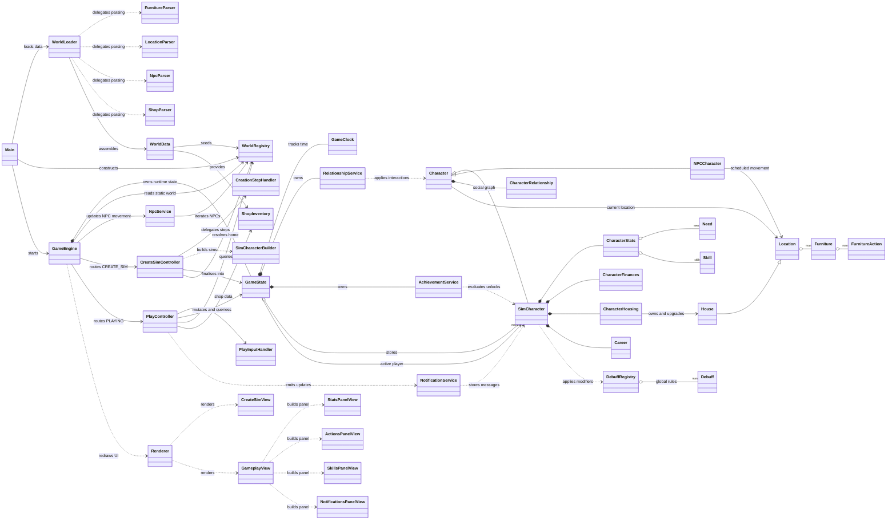

<div id="top"></div>

<br />
<div align="center">

<h1 align="center">CLI Sims Simulation Game</h1>

<p align="center">
  A Java command-line life simulation game inspired by <em>The Sims</em>
  <br />
  <br />
  <a href="#overview">Overview</a>
  ·
  <a href="#gameplay-summary">Gameplay</a>
  ·
  <a href="#user-guide">User Guide</a>
  ·
  <a href="#system-overview">Architecture</a>
  ·
  <a href="#how-to-run-the-game">Run the Game</a>
</p>

</div>

---

## Table of Contents

- [Overview](#overview)
- [Project Pitch](#project-pitch)
- [Main Features](#main-features)
- [Game World](#game-world)
- [Needs System](#needs-system)
- [Skills and Careers](#skills-and-careers)
- [Housing and Upgrades](#housing-and-upgrades)
- [User Guide](#user-guide)
- [System Overview](#system-overview)
- [File Hierarchy](#file-hierarchy)
- [Requirements](#requirements)
- [How to Run the Game](#how-to-run-the-game)
- [How to Run Tests](#how-to-run-tests)

---

## Overview

This project recreates the core life-simulation loop in a text-based interface: create Sims, manage their needs, build skills, choose careers, earn money, travel between locations, interact with other characters, and upgrade a home.

The emphasis is on simulation logic, modular design, and object-oriented structure rather than graphics.

<p align="right">(<a href="#top">back to top</a>)</p>

## Project Pitch

This project transforms a typically graphical genre into a structured terminal experience.

What makes it notable:

- **Full life-simulation loop in CLI form**
- **Time-driven gameplay** with in-game day and hour progression
- **Need management** that affects what a Sim can do
- **Skill and career progression** with meaningful long-term planning
- **Location-based actions** tied to furniture and world spaces
- **NPC movement and social interactions** that make the world feel active
- **Housing and furniture upgrades** that improve efficiency and progression
- **Object-oriented architecture** built around separable models, controllers, services, and data loading

It is a multi-system simulation with interconnected mechanics.

<p align="right">(<a href="#top">back to top</a>)</p>

## Gameplay Summary

### Core Gameplay Loop

The game is built around a repeating progression cycle:

**Manage needs -> perform activities -> build skills -> work for income -> buy upgrades -> improve efficiency**

A strong run depends on balancing short-term survival with long-term progression.

Example flow:

1. Recover urgent needs such as energy or hunger.
2. Travel to a useful location.
3. Perform actions to train skills or restore stats.
4. Work a shift to earn money.
5. Buy better furniture or a better house.
6. Repeat with stronger stats and faster recovery.

<p align="right">(<a href="#top">back to top</a>)</p>

## Main Features

### Simulation Systems

- Create one or more Sims
- Select and switch the active Sim
- Persistent in-game clock with day and time progression
- Need decay and need recovery through actions
- Debuffs or reduced effectiveness when needs are neglected

### Progression Systems

- Skill XP and level progression
- Career selection and work shifts
- Salary and rank progression
- Achievement tracking
- Notification updates for important events and milestones

### World Systems

- Multiple playable locations
- Location-based furniture and actions
- NPCs that move based on schedules
- Social interactions and relationship changes

### Economy and Housing

- Money earning and spending
- House purchasing
- Furniture buying and selling
- Upgrades that improve quality of life and recovery options

<p align="right">(<a href="#top">back to top</a>)</p>

## Game World

The current world includes these main locations:

- **Home**
- **Restaurant**
- **Gym**
- **Park**
- **Cafe**
- **Library**
- **Club**
- **Office**

Each location offers different furniture, activities, and interaction opportunities.

<p align="right">(<a href="#top">back to top</a>)</p>

## Needs System

Each Sim is driven by five core needs:

- **Hunger**
- **Hygiene**
- **Energy**
- **Fun**
- **Social**

These values decline over time. Ignoring them makes the Sim less effective and can limit progress. Efficient play means keeping needs stable before they become a problem.

### Early-Game Priorities

- Restore **energy** before long activities or work
- Keep **hunger** under control so the Sim stays productive
- Maintain **hygiene** to avoid poor overall condition
- Do not ignore **fun** and **social**, or the Sim will fall behind in balance

<p align="right">(<a href="#top">back to top</a>)</p>

## Skills and Careers

### Skills

The project includes these skill types:

- Cooking
- Fitness
- Programming
- Charisma
- Creativity
- Logic
- Music
- Writing
- Painting

Skills improve through actions and support long-term progression.

### Careers

Available career paths include:

- Software Developer
- Engineer
- Doctor
- Teacher
- Lawyer
- Police Officer
- Accountant
- Business Manager
- Chef
- Artist
- Musician
- Writer

Careers differ in salary, working hours, and related skills. Choosing a career that matches a training plan leads to stronger progression.

<p align="right">(<a href="#top">back to top</a>)</p>

## Housing and Upgrades

The game begins with a basic home setup and allows the player to improve living conditions over time.

### Houses for Sale

- Cozy Apartment
- Modern House
- Luxury Cottage
- Mansion

### Upgrade Path

Better houses and furniture improve the Sim's available actions and overall efficiency. Housing is part of the gameplay strategy, not just decoration.

<p align="right">(<a href="#top">back to top</a>)</p>

## User Guide

### 1. Starting the Game

Run the application from the project entry point:

```text
src/app/Main.java
```

It loads world data, constructs the runtime systems, and starts the game loop.

### 2. Creating Sims

When the game starts, the Sim creation flow begins.

You will be asked to:

1. Choose how many Sims to create.
2. Enter each Sim's name.
3. Enter age.
4. Enter gender.
5. Confirm the created roster.
6. Choose which Sim will be the active Sim.

After this, the game enters the main gameplay screen.

### 3. Understanding the Gameplay Screen

The gameplay UI is displayed as a multi-panel CLI screen.

It presents:

- Current day and time
- Active Sim information
- Current location
- Available actions
- Skill progress
- Notifications

This layout keeps the game readable while still showing multiple systems at once.

### 4. Main Menu Actions

#### Interact with Objects
Use furniture or world objects at the current location.

Examples include:

- Sleep or nap
- Cook or eat
- Shower
- Study
- Work
- Exercise
- Leisure activities

#### Socialise
Interact with nearby Sims or NPCs to improve relationships and support the social need.

#### Change Location
Move to another location to access different furniture, activities, and characters.

#### Switch Active Sim
Swap control to another Sim when multiple Sims exist.

#### Open the Shop
Upgrade the house, buy furniture, or sell furniture.

#### Exit the Game
End the current session.

### 5. How to Play Effectively

#### Basic Strategy

- Do not let one need collapse while focusing on another
- Train skills that support the chosen career
- Work when the Sim is in good condition, not when depleted
- Upgrade furniture early for more efficient recovery

#### Recommended Beginner Flow

1. Recover energy and hunger at Home.
2. Visit a location that helps the chosen skill direction.
3. Build skill XP.
4. Take or continue a career path.
5. Earn money.
6. Buy better furniture.
7. Repeat the cycle.

### 6. Example Progression Path

A simple example:

- Start with a basic home and limited resources
- Use available furniture to maintain needs
- Train Programming and Logic
- Join the Software Developer career
- Earn salary through work shifts
- Upgrade from the starter home to a stronger property
- Continue improving efficiency, skills, and income

This demonstrates how the game systems connect into one coherent simulation.

<p align="right">(<a href="#top">back to top</a>)</p>

## System Overview

### Architecture Summary

The project is organized into clear object-oriented layers:

- **app** - application entry point
- **core** - engine, state, clock, and world registry
- **controller** - gameplay and creation flow handling
- **models** - Sims, NPCs, needs, careers, skills, furniture, locations, debuffs, and progression
- **services** - achievement, house, notification, NPC, and relationship logic
- **data** - loading world data and shop data from text files
- **ui** - CLI rendering and gameplay panels
- **test** - JUnit tests for core systems and features

This separation improves readability, maintainability, and extensibility.

### Data-Driven Design

World content is loaded from plain text files, including:

- Locations
- Furniture and actions
- NPC data
- Shop inventory

This supports the specification constraint of avoiding databases and keeping data in file-based form.

<p align="right">(<a href="#top">back to top</a>)</p>

## File Hierarchy

```text
OOP/
├─ README.md
├─ src/
│  ├─ app/
│  ├─ controller/
│  ├─ core/
│  ├─ data/
│  ├─ models/
│  │  ├─ actions/
│  │  ├─ career/
│  │  ├─ character/
│  │  │  ├─ finances/
│  │  │  ├─ housing/
│  │  │  ├─ relationship/
│  │  │  └─ stats/
│  │  ├─ debuffs/
│  │  ├─ furniture/
│  │  ├─ location/
│  │  ├─ need/
│  │  ├─ progression/
│  │  └─ skill/
│  ├─ services/
│  ├─ types/
│  ├─ ui/
│  │  ├─ panels/
│  │  └─ views/
└─ └─ test/
```

<p align="right">(<a href="#top">back to top</a>)</p>

## Abstracted UML Diagram



<p align="right">(<a href="#top">back to top</a>)</p>


## Requirements

### Required Software

- **Java JDK 25 or newer**
- A terminal that preferably supports ANSI output

### Notes

- This project does **not** use Maven or Gradle.
- Source files are compiled manually with `java`.
- Main entry point: `app.Main`
- Tests use **JUnit 5 (Jupiter)**.

<p align="right">(<a href="#top">back to top</a>)</p>

## How to Run the Game

### macOS / Linux

Open Terminal in the project root folder, then run:

```bash
java app/Main.java
```

### Windows (PowerShell)

Open PowerShell in the project root folder, then run:

```powershell
javac -d out (Get-ChildItem -Recurse src\*.java).FullName; java -cp out app.Main
```

### Alternative for Some Windows Users

Some users may be able to run the project by pressing `Run Java` in their IDE.

This usually works in editors such as:

1. VS Code with the Java extensions installed
2. IntelliJ IDEA
3. Other IDEs with Java project support

However, this depends on the editor being configured correctly. The most reliable method is still the PowerShell command above.

### Notes for Windows

- If `javac` or `java` is not recognised, install a compatible JDK and make sure it is added to `PATH`.
- Check with:

```powershell
java --version
javac --version
```

<p align="right">(<a href="#top">back to top</a>)</p>

## How to Run Tests

The project uses JUnit 5, but the repository does not include a build tool. You need a local copy of the **JUnit Platform Console Standalone** jar.

Place the jar in a folder named `lib/` at the project root, for example:

```text
lib/
└─ junit-platform-console-standalone.jar
```

<p align="right">(<a href="#top">back to top</a>)</p>
